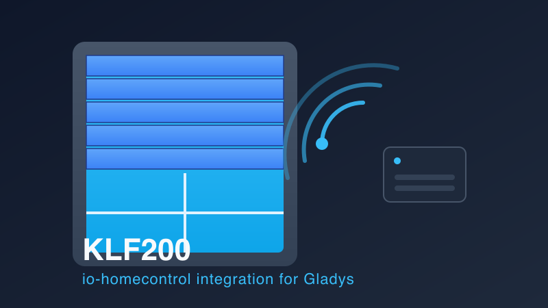

# KLF200 - io-homecontrol

[](https://github.com/vincentBesseau/gladys-klf-200-io-homecontrol/tags)
[](https://github.com/vincentBesseau/gladys-klf-200-io-homecontrol/actions/workflows/ci.yml)
[](https://github.com/vincentBesseau/gladys-klf-200-io-homecontrol/pkgs/container/gladys-klf-200-io-homecontrol)
[](package.json)
[](https://gladysassistant.com)



Intégration [Gladys Assistant](https://gladysassistant.com) (external integration officielle, SDK
`@gladysassistant/integration-sdk`) pour découvrir et piloter les volets/fenêtres **io-homecontrol®**
déjà appairés à une passerelle Velux **KLF200** sur le réseau local.

> io-homecontrol® est une marque déposée de l'alliance io-homecontrol. Ce projet n'est pas affilié à
> Velux ni à io-homecontrol ; il s'agit d'une intégration tierce open-source basée sur
> [`klf-200-api`](https://www.npmjs.com/package/klf-200-api).

## Fonctionnalités

- **Découverte automatique** des volets déjà appairés au KLF200 (pas de réappairage matériel).
- Deux fonctionnalités par volet, toutes deux pilotables depuis Gladys :
  - **Position** : slider 0–100 %.
  - **État** : bouton ouvert / stop / fermé.
- **Polling** toutes les 60 s : les changements faits en dehors de Gladys (télécommande physique,
  appli Velux) remontent automatiquement.
- Reconnexion automatique (retry 30 s) si la passerelle est temporairement injoignable — le KLF200
  n'accepte qu'une seule session à la fois et peut être lent à en libérer une.

## Configuration

Depuis l'écran de configuration de l'intégration dans Gladys :

| Champ                       | Description                                           |
| --------------------------- | ----------------------------------------------------- |
| Adresse IP du KLF200        | IP locale de la passerelle                            |
| Mot de passe du KLF200      | Mot de passe défini sur la passerelle                 |
| Empreinte TLS (optionnelle) | Épinglage du certificat ; laisser vide pour l'ignorer |

## Développement

```bash
npm install
npm test
```

Build de l'image Docker :

```bash
docker build -t klf200-gladys:dev .
```

Installation en mode développeur dans Gladys : `Intégrations` → `Installer depuis GitHub` →
`Mode développeur : installer depuis une image Docker` → `klf200-gladys:dev`.

## Architecture

- [`index.js`](index.js) — câblage du SDK Gladys (découverte, commandes, polling, cycle de connexion).
- [`src/klf/`](src/klf) — connexion au KLF200 (`connection.js`), cache des volets (`products.js`),
  mapping vers le modèle Gladys (`mapProduct.js`).
- [`src/devices/shutter.js`](src/devices/shutter.js) — orchestration découverte/commande/poll.

## Licence

UNLICENSED — projet personnel non publié sur npm.
